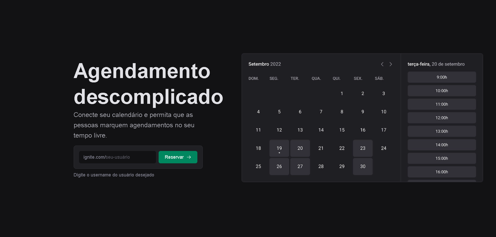

# ignite Call

<div align="center">
	
</div>

## :dart: Objetivo

Projeto de agendamento desenvolvido com o conteúdo estudado nas aulas do Chapter
VI da trilha de ReactJS do Bootcamp Ignite da Rocketseat.

## :hammer_and_wrench: Ferramentas

- [@prisma/client](https://www.prisma.io/)
- [@tanstack/react-query](https://www.npmjs.com/package/@tanstack/react-query)
- [axios](https://www.npmjs.com/package/axios)
- [dayjs](https://www.npmjs.com/package/dayjs)
- [googleapis](https://www.npmjs.com/package/googleapis)
- [next-auth](https://next-auth.js.org/)
- [next-seo](https://github.com/garmeeh/next-seo)
- [nookies](https://www.npmjs.com/package/nookies)
- [phosphor-react](https://www.npmjs.com/package/phosphor-react)
- [react-hook-form](https://react-hook-form.com/)
- [typescript](https://www.typescriptlang.org/)
- [zod](https://zod.dev/)

## :desktop_computer: Padronização de código

- [Eslint](https://eslint.org/)
- [Prettier](https://prettier.io/)
- [EditorConfig](https://editorconfig.org/)

## :rocket: Executando o projeto

```bash
// Instale as dependências

yarn install

// Concluindo a instalação rode

yarn dev
```
